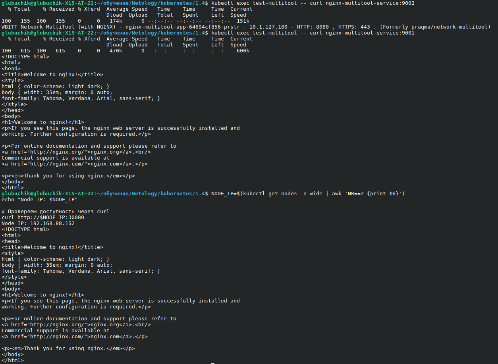
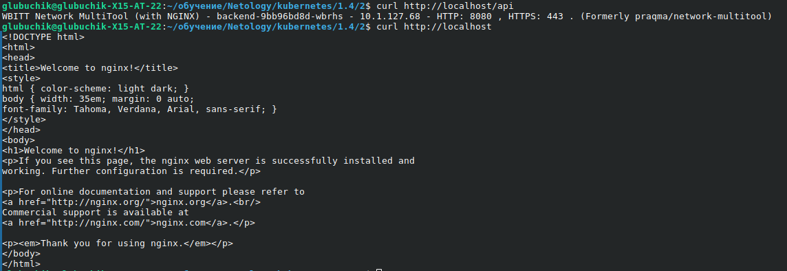

## **Задание 1: Настройка Service (ClusterIP и NodePort)**
### **Что сдать на проверку**
- Манифесты:
  - [deployment-multi-container.yaml](1/deployment-multi-container.yaml)
  - [service-clusterip.yaml](1/service-clusterip.yaml)
  - [service-nodeport.yaml](1/service-nodeport.yaml)
- Скриншоты проверки доступа 

## **Задание 2: Настройка Ingress**
### **Что сдать на проверку**
- Манифесты:
  - [deployment-frontend.yaml](2/deployment-frontend.yaml)
  - [deployment-backend.yaml](2/deployment-backend.yaml)
  - [service-frontend.yaml](2/service-frontend.yaml)
  - [service-backend.yaml](2/service-backend.yaml)
  - [ingress.yaml](2/ingress.yaml)
- Скриншоты проверки доступа 