## Задание 1. Volume: обмен данными между контейнерами в поде
### Шаги выполнения
1. Создать Deployment приложения, состоящего из контейнеров busybox и multitool.
2. Настроить busybox на запись данных каждые 5 секунд в некий файл в общей директории.
3. Обеспечить возможность чтения файла контейнером multitool.

### Что сдать на проверку
- Манифесты:
  - [containers-data-exchange.yaml](1/containers-data-exchange.yaml)
- Скриншоты:
  - описание пода с контейнерами (`kubectl describe pods data-exchange`)
  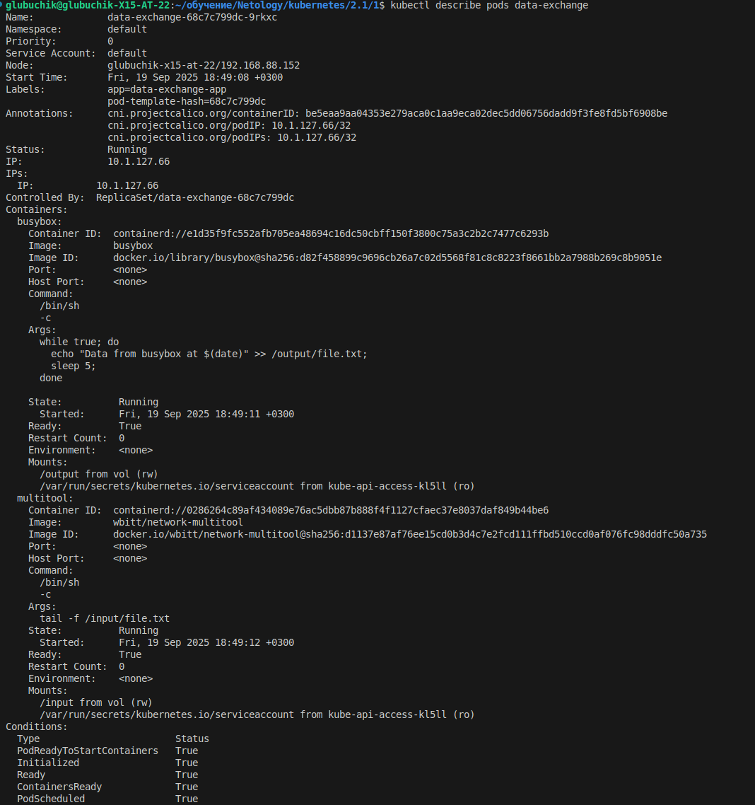
  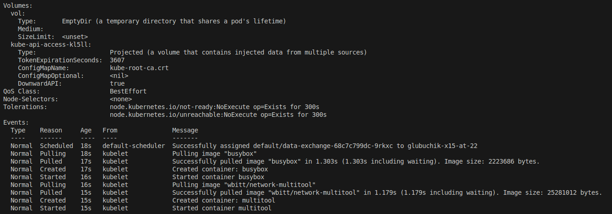
  - вывод команды чтения файла (`tail -f <имя общего файла>`)
  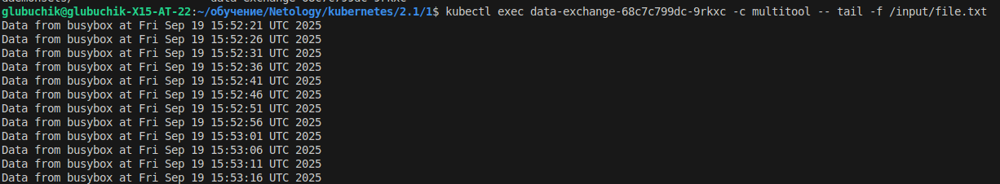
  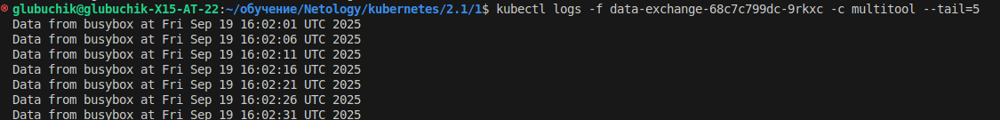

## Задание 2. PV, PVC
### Шаги выполнения
1. Создать Deployment приложения, состоящего из контейнеров busybox и multitool, использующего созданный ранее PVC
2. Создать PV и PVC для подключения папки на локальной ноде, которая будет использована в поде.
3. Продемонстрировать, что контейнер multitool может читать данные из файла в смонтированной директории, в который busybox записывает данные каждые 5 секунд.
4. Удалить Deployment и PVC. Продемонстрировать, что после этого произошло с PV. Пояснить, почему. (Используйте команду `kubectl describe pv`).
5. Продемонстрировать, что файл сохранился на локальном диске ноды. Удалить PV.  Продемонстрировать, что произошло с файлом после удаления PV. Пояснить, почему.

### Что сдать на проверку
- Манифесты:
  - [pv-pvc.yaml](2/pv-pvc.yaml)
- Скриншоты:
  - каждый шаг выполнения задания, начиная с шага 2.
    3. 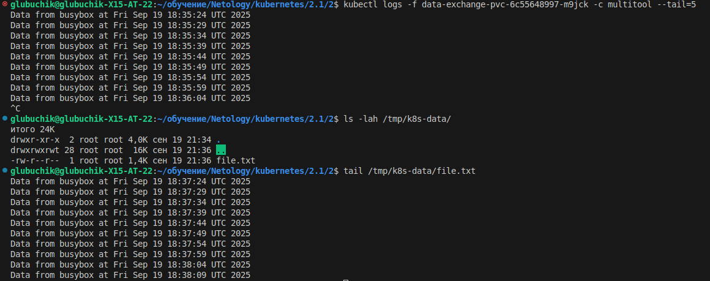
    4. 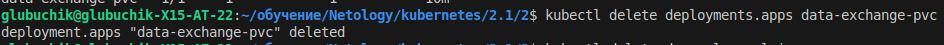
    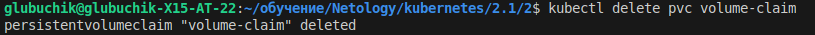
    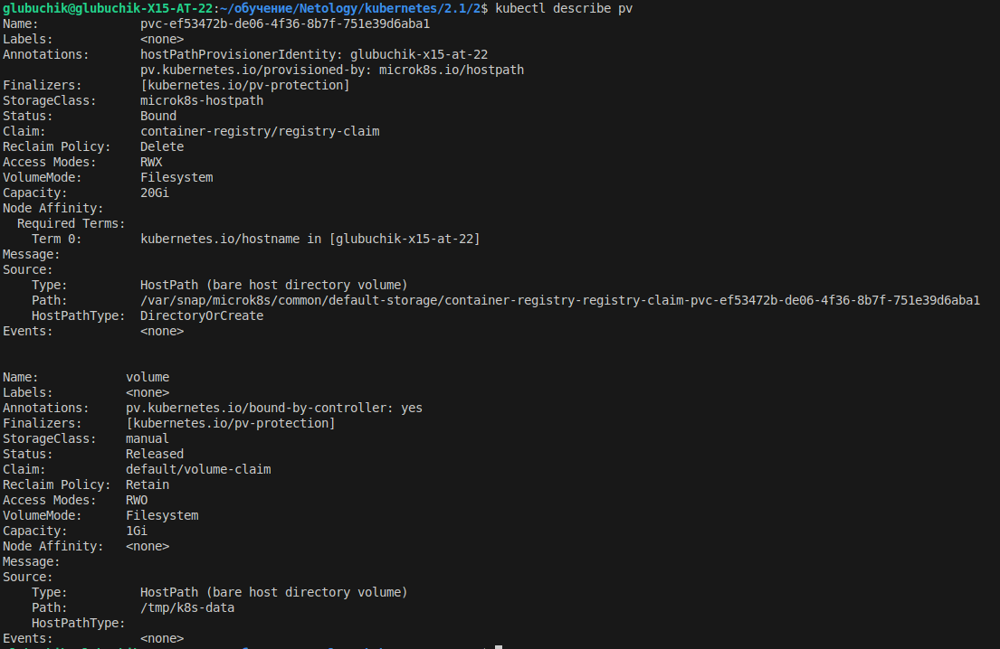
    5. 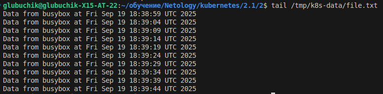
    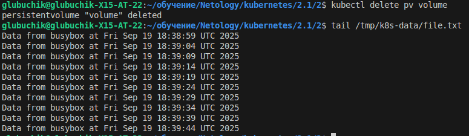
- Описания:
  - объяснение наблюдаемого поведения ресурсов в двух последних шагах.
  PV переходит в статус Released, но не удаляется автоматически. Это происходит потому, что: PersistentVolumeReclaimPolicy: Retain -  При удалении или освобождении PVC данные PV также сохраняются. PV не удаляется, а данные остаются целыми.

  ## Задание 3. StorageClass
### Задача
Создать Deployment приложения, использующего PVC, созданный на основе StorageClass.

### Шаги выполнения

1. Создать Deployment приложения, состоящего из контейнеров busybox и multitool, использующего созданный ранее PVC.
2. Создать SC и PVC для подключения папки на локальной ноде, которая будет использована в поде.
3. Продемонстрировать, что контейнер multitool может читать данные из файла в смонтированной директории, в который busybox записывает данные каждые 5 секунд.

### Что сдать на проверку
- Манифесты:
  - [sc.yaml](3/sc.yaml)
- Скриншоты:
  - каждый шаг выполнения задания, начиная с шага 2
  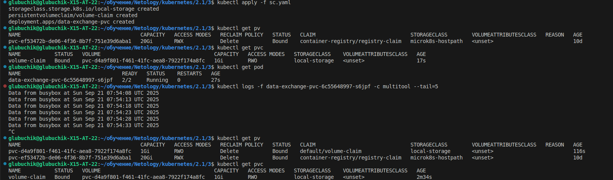