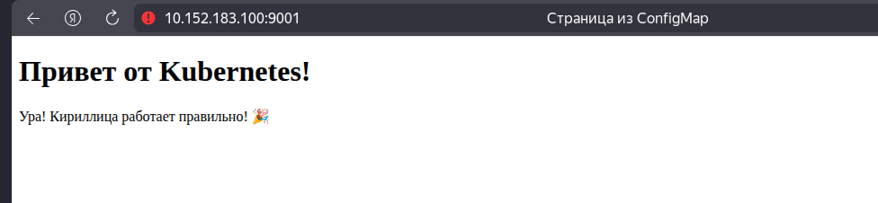
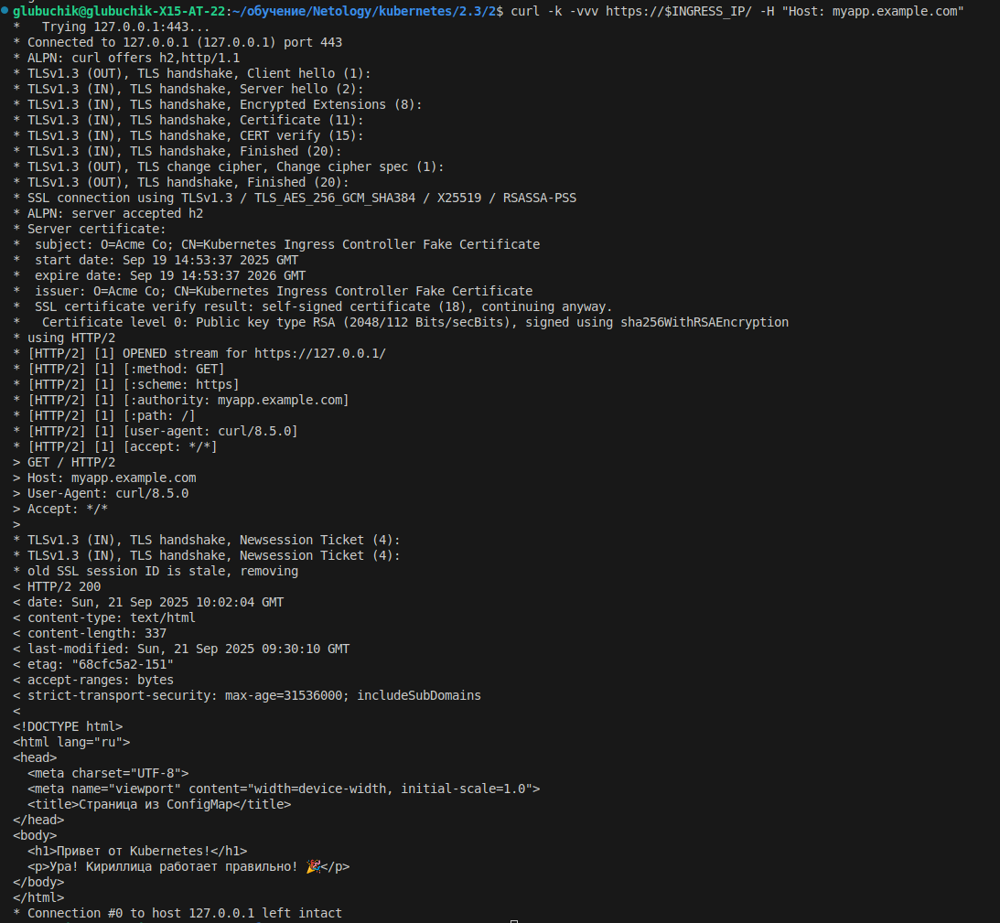
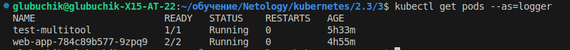

## **Задание 1: Работа с ConfigMaps**
### **Шаги выполнения**
1. **Создать Deployment** с двумя контейнерами
   - `nginx`
   - `multitool`
3. **Подключить веб-страницу** через ConfigMap
4. **Проверить доступность**

### **Что сдать на проверку**
- Манифесты:
  - [deployment.yaml](1/deployment.yaml)
  - [configmap-web.yaml](1/configmap-web.yaml)
- Скриншот вывода `curl` или браузера
  

## **Задание 2: Настройка HTTPS с Secrets**  
### **Шаги выполнения**  
1. **Сгенерировать SSL-сертификат**
```bash
openssl req -x509 -nodes -days 365 -newkey rsa:2048 \
  -keyout tls.key -out tls.crt -subj "/CN=myapp.example.com"
```
2. **Создать Secret**
3. **Настроить Ingress**
4. **Проверить HTTPS-доступ**

### **Что сдать на проверку**  
- Манифесты:
  - [secret-tls.yaml](2/secret-tls.yaml)
  - [ingress-tls.yaml](2/ingress-tls.yaml)
- Скриншот вывода `curl -k`
  


## **Задание 3: Настройка RBAC**  
### **Задача**  
Создать пользователя с ограниченными правами (только просмотр логов и описания подов).

### **Шаги выполнения**  
1. **Включите RBAC в microk8s**
```bash
microk8s enable rbac
```
2. **Создать SSL-сертификат для пользователя**
```bash
openssl genrsa -out developer.key 2048
openssl req -new -key developer.key -out developer.csr -subj "/CN={ИМЯ ПОЛЬЗОВАТЕЛЯ}"
openssl x509 -req -in developer.csr -CA {CA серт вашего кластера} -CAkey {CA ключ вашего кластера} -CAcreateserial -out developer.crt -days 365
```
3. **Создать Role (только просмотр логов и описания подов) и RoleBinding**
4. **Проверить доступ**

### **Что сдать на проверку**  
- Манифесты:
  - [role-pod-reader.yaml](role-pod-reader.yaml)
  - [rolebinding-developer.yaml](rolebinding-developer.yaml)
- Команды генерации сертификатов
```bash
openssl genrsa -out developer.key 2048
openssl req -new -key developer.key -out developer.csr -subj "/CN=logger"
CA_CERT=/var/snap/microk8s/current/certs/ca.crt
CA_KEY=/var/snap/microk8s/current/certs/ca.key
sudo openssl x509 -req -in developer.csr -CA $CA_CERT -CAkey $CA_KEY -CAcreateserial -out developer.crt -days 365
```
- Скриншот проверки прав (`kubectl get pods --as=developer`)
  