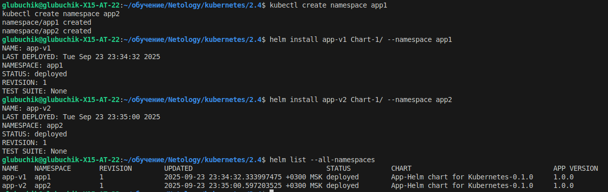
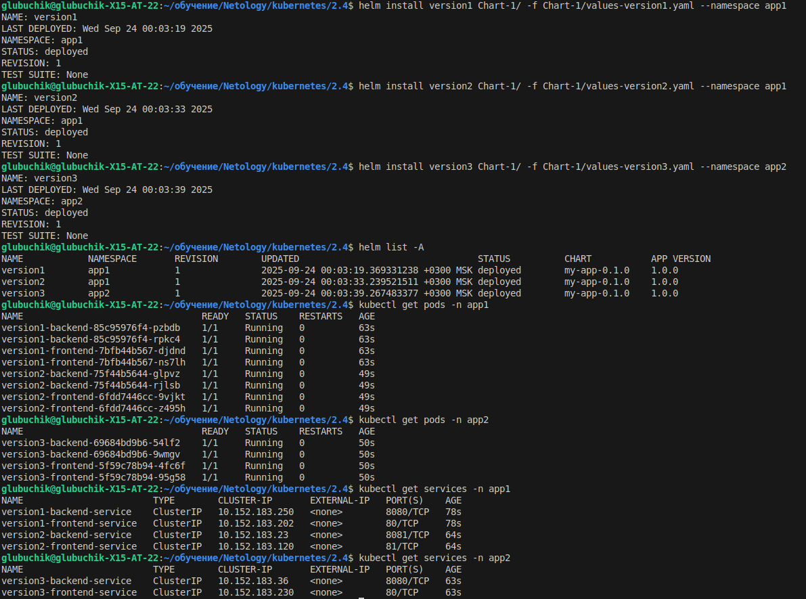

[Chart.yaml](Chart-1/Chart.yaml)

[values.yaml](Chart-1/values.yaml)

[values-version1.yaml](Chart-1/values-version1.yaml)

[values-version2.yaml](Chart-1/values-version2.yaml)

[values-version3.yaml](Chart-1/values-version3.yaml)

[templates/deployment-backend.yaml](Chart-1/templates/deployment-backend.yaml)

[templates/deployment-frontend.yaml](Chart-1/templates/deployment-frontend.yaml)

[templates/service-backend.yaml](Chart-1/templates/service-backend.yaml)

[templates/service-frontend.yaml](Chart-1/templates/service-frontend.yaml)

[templates/deployment.yaml](Chart-1/templates/deployment.yaml)