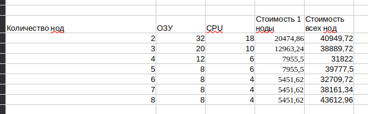

# Домашнее задание к занятию «Компоненты Kubernetes»

### Цель задания

Рассчитать требования к кластеру под проект

------

### Инструменты и дополнительные материалы, которые пригодятся для выполнения задания:

- [Considerations for large clusters](https://kubernetes.io/docs/setup/best-practices/cluster-large/),
- [Architecting Kubernetes clusters — choosing a worker node size](https://learnk8s.io/kubernetes-node-size).

------

### Задание. Необходимо определить требуемые ресурсы
Известно, что проекту нужны база данных, система кеширования, а само приложение состоит из бекенда и фронтенда. Опишите, какие ресурсы нужны, если известно:

1. Необходимо упаковать приложение в чарт для деплоя в разные окружения. 
2. База данных должна быть отказоустойчивой. Потребляет 4 ГБ ОЗУ в работе, 1 ядро. 3 копии. 
3. Кеш должен быть отказоустойчивый. Потребляет 4 ГБ ОЗУ в работе, 1 ядро. 3 копии. 
4. Фронтенд обрабатывает внешние запросы быстро, отдавая статику. Потребляет не более 50 МБ ОЗУ на каждый экземпляр, 0.2 ядра. 5 копий. 
5. Бекенд потребляет 600 МБ ОЗУ и по 1 ядру на копию. 10 копий.

----
## Решение

### Расчет ресурсов для рабочих нод
POD | ОЗУ | CPU	копии | ОЗУ для всех копий | CPU для всех копий
----|-----|-----------|--------------------|-------------------
БД | 4 | 1 | 3 | 12 | 3
Кеш | 4 | 1 | 3 | 12 | 3
Фронтенд | 0,05 | 0,2 | 5 | 0,25 | 1
Бекенд | 0,6 | 1 | 10 | 6 | 10

**Всего нужно 30,25ГБ ОЗУ и 17 CPU** 

Следуя советам из статьи https://habr.com/ru/companies/nixys/articles/573316/ , написал калькулятор для расчета ресурсов в зависимости от количества нод:
[Расчеты.xlsx](Расчеты.xlsx)

Запас ресурсов = Количество подов на ноду * Максимальное количество ресурсов на под/(Количество нод - Максимальное допустимое количество отключенных нод)

Принимаем что для системных компонентов потремуется 2ГБ ОЗУ и 2 CPU(рекомендации взял от сюда https://cloud.ru/docs/kubernetes/ug/topics/faq_nodes-resources)

#### Возьмем разное количество нод и подставим в калькулятор:

**2 ноды:**
...| ОЗУ | CPU 
---|-----|----
Ресурсы для одной ноды округленные в большую сторону | 32 | 18
ВСЕГО ресурсов требующихся для всех нод | 64 | 36
Количество ресурсов оставшихся для приложения при падении нод (без ресурсов для системных компонентов) | 32 | 18

***Вывод:*** Нужно много ресурсов, не думаю что это оптимальный вариант

**3 ноды:**
...| ОЗУ | CPU 
---|-----|----
Ресурсы для одной ноды округленные в большую сторону | 16 | 10
ВСЕГО ресурсов требующихся для всех нод | 48 | 20
Количество ресурсов оставшихся для приложения при падении нод (без ресурсов для системных компонентов) | 32 | 20

***Вывод:*** Нужно гораздо меньше ресурсов чем при использовании двух нод, после падения 1 ноды остается больший запас по CPU

**4 ноды:**
...| ОЗУ | CPU 
---|-----|----
Ресурсы для одной ноды округленные в большую сторону | 12 | 6
ВСЕГО ресурсов требующихся для всех нод | 48 | 24
Количество ресурсов оставшихся для приложения при падении нод (без ресурсов для системных компонентов) | 36 | 18

***Вывод:*** Нужно чуть больше СPU чем при использовании 3х нод, после падения 1 ноды остается мненьше запаса по CPU, но больший запас по ОЗУ. 

**5 ноды:**
...| ОЗУ | CPU 
---|-----|----
Ресурсы для одной ноды округленные в большую сторону | 8 | 6
ВСЕГО ресурсов требующихся для всех нод | 40 | 30
Количество ресурсов оставшихся для приложения при падении нод (без ресурсов для системных компонентов) | 32 | 24

**6 ноды:**
...| ОЗУ | CPU 
---|-----|----
Ресурсы для одной ноды округленные в большую сторону | 8 | 4
ВСЕГО ресурсов требующихся для всех нод | 48 | 24
Количество ресурсов оставшихся для приложения при падении нод (без ресурсов для системных компонентов) | 40 | 20

***Вывод:*** Нужно чуть больше СPU чем при использовании 3х нод и столько же сколько при 4 нодах, но после падения останется больше ресурсов. 

**7 ноды:**
...| ОЗУ | CPU 
---|-----|----
Ресурсы для одной ноды округленные в большую сторону | 6 | 4
ВСЕГО ресурсов требующихся для всех нод | 42 | 28
Количество ресурсов оставшихся для приложения при падении нод (без ресурсов для системных компонентов) | 36 | 24

***Вывод:*** Нужно на 8 СPU больше на 6 ОЗУ меньше чем при использовании 3х нод.

**8 ноды:**
...| ОЗУ | CPU 
---|-----|----
Ресурсы для одной ноды округленные в большую сторону | 6 | 4
ВСЕГО ресурсов требующихся для всех нод | 48 | 32
Количество ресурсов оставшихся для приложения при падении нод (без ресурсов для системных компонентов) | 42 | 28

***Вывод:*** Нужно на 12 СPU больше чем при использовании 3х нод, но гарантированно переживем падение 2х нод.

**9 ноды:**
...| ОЗУ | CPU 
---|-----|----
Ресурсы для одной ноды округленные в большую сторону | 4 | 4
ВСЕГО ресурсов требующихся для всех нод | 36 | 36
Количество ресурсов оставшихся для приложения при падении нод (без ресурсов для системных компонентов) | 32 | 32

***Вывод:*** Дальнейшее увеличение нод не целесобразно так как если количество ОЗУ на ноде будет < 6 на нем не будут корректно работать поды БД и кэш, большинство ресурсов будет уходить на обслуживание системных компонентов.

**ВЫВОД** 

По этим табличкам интереснее всего смотрится 3, 6 и 8 нод. 
Идем подбирать машины на яндекс облаке и оказывается, что количество ОЗУ должно быть кратным количество CPU и мы не можем взять 16 ОЗУ 10 CPU, а придется брать 20 ОЗУ 10 CPU, и это дорого. Самая дешевая конфигурация будет из 4 нодов, чуть подороже из 6, из 8 нодов будет самая дорогая, так как мы не можем взять 6 ОЗУ 4 CPU, но с ней мы без болезнено можем потерять 2 ноды.

Я бы предложил использовать для worker nod 6 нод 8 ОЗУ 4 CPU, это будет чуть дороже чем использовать 4 ноды, но даст больше ресурсов при падении ноды, в теории при падении 2х нод у нас будет 32 ОЗУ(нужно 30.25) и 16(нужно 17) можно попробовать аварийно поднять все поды занизив лимиты для каких-то подов.
Также нужно 3 мастер ноды, у яндекса минимальная мастер нода 2 CPU 8 ОЗУ

----

### Правила приёма работы

1. Домашняя работа оформляется в своем Git-репозитории в файле README.md. Выполненное домашнее задание пришлите ссылкой на .md-файл в вашем репозитории.
2. Сначала сделайте расчёт всех необходимых ресурсов.
3. Затем прикиньте количество рабочих нод, которые справятся с такой нагрузкой.
4. Добавьте к полученным цифрам запас, который учитывает выход из строя как минимум одной ноды. 
5. Добавьте служебные ресурсы к нодам. Помните, что для разных типов нод требовния к ресурсам разные. 
6. В результате должно быть указано количество нод и их параметры.

