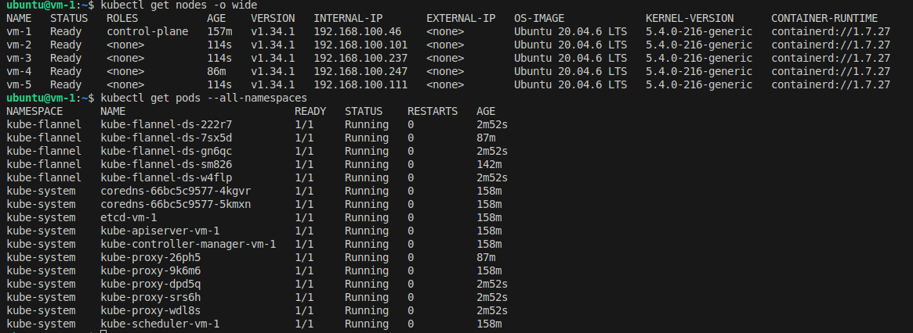

Поднимаем 5 виртуальных машин.

[terraform](../terraform-vbox/)

### Устанавливаем на все машины kubeadm
```bash
sudo apt update && sudo apt upgrade -y
sudo apt install -y curl wget gnupg2 software-properties-common apt-transport-https ca-certificates gpg
sudo swapoff -a
sudo sed -i '/ swap / s/^\(.*\)$/#\1/g' /etc/fstab
cat <<EOF | sudo tee /etc/modules-load.d/k8s.conf
overlay
br_netfilter
EOF
overlay
br_netfilter
sudo modprobe overlay
sudo modprobe br_netfilter
cat <<EOF | sudo tee /etc/sysctl.d/k8s.conf
net.bridge.bridge-nf-call-iptables  = 1
net.bridge.bridge-nf-call-ip6tables = 1
net.ipv4.ip_forward                 = 1
EOF
sudo sysctl --system 
# Установка containerd
# Обновляем пакеты
sudo apt update

# Устанавливаем зависимости
sudo apt install -y apt-transport-https ca-certificates curl gnupg

# Добавляем ключ Docker
curl -fsSL https://download.docker.com/linux/ubuntu/gpg | sudo gpg --dearmor -o /usr/share/keyrings/docker-archive-keyring.gpg

# Добавляем репозиторий Docker
echo "deb [arch=amd64 signed-by=/usr/share/keyrings/docker-archive-keyring.gpg] https://download.docker.com/linux/ubuntu $(lsb_release -cs) stable" | sudo tee /etc/apt/sources.list.d/docker.list > /dev/null

# Обновляем пакеты
sudo apt update

# Устанавливаем containerd
sudo apt install -y containerd.io
curl -LO "https://dl.k8s.io/release/$(curl -L -s https://dl.k8s.io/release/stable.txt)/bin/linux/amd64/kubectl"
curl -LO "https://dl.k8s.io/release/$(curl -L -s https://dl.k8s.io/release/stable.txt)/bin/linux/amd64/kubectl.sha256"
sudo install -o root -g root -m 0755 kubectl /usr/local/bin/kubectl
sudo apt-get update
sudo mkdir -p -m 755 /etc/apt/keyrings
curl -fsSL https://pkgs.k8s.io/core:/stable:/v1.34/deb/Release.key | sudo gpg --dearmor -o /etc/apt/keyrings/kubernetes-apt-keyring.gpg
echo 'deb [signed-by=/etc/apt/keyrings/kubernetes-apt-keyring.gpg] https://pkgs.k8s.io/core:/stable:/v1.34/deb/ /' | sudo tee /etc/apt/sources.list.d/kubernetes.list
sudo apt-get update
sudo apt-get install -y kubelet kubeadm kubectl
sudo systemctl enable --now kubelet
```


containerd использует CRI v2, а kubeadm 1.26 и выше поддерживает только CRI v1.
Указываем containerd использовать CRI v1
```bash
# Остановка всех служб
sudo kubeadm reset -f
sudo systemctl stop kubelet
sudo systemctl stop containerd

# Очистка конфигурации
sudo rm -rf /etc/containerd/config.toml

# Создание базовой конфигурации
sudo mkdir -p /etc/containerd
sudo containerd config default | sudo tee /etc/containerd/config.toml

# Настройка для поддержки CRI v1
sudo tee /etc/containerd/config.toml > /dev/null <<'EOF'
version = 2
root = "/var/lib/containerd"
state = "/run/containerd"
oom_score = 0

[grpc]
  address = "/run/containerd/containerd.sock"
  uid = 0
  gid = 0

[metrics]
  address = ""
  grpc_histogram = false

[plugins]
  [plugins."io.containerd.grpc.v1.cri"]
    disable_tcp_service = false
    enable_selinux = false
    sandbox_image = "registry.k8s.io/pause:3.9"
    
    [plugins."io.containerd.grpc.v1.cri".containerd]
      disable_tcp_service = false
      snapshotter = "overlayfs"
      
      [plugins."io.containerd.grpc.v1.cri".containerd.runtimes.runc]
        runtime_type = "io.containerd.runc.v2"
        [plugins."io.containerd.grpc.v1.cri".containerd.runtimes.runc.options]
          SystemdCgroup = true

  [plugins."io.containerd.internal.v1.opt"]
    path = "/opt/containerd"

  [plugins."io.containerd.internal.v1.restart"]
    interval = "10s"

  [plugins."io.containerd.metadata.v1.bolt"]
    content_sharing_policy = "shared"

  [plugins."io.containerd.monitor.v1.cgroups"]
    no_prometheus = false

  [plugins."io.containerd.runtime.v1.linux"]
    shim = "containerd-shim"
    runtime = "runc"
    runtime_root = ""
    no_shim = false
    shim_debug = false

  [plugins."io.containerd.runtime.v2.task"]
    platforms = ["linux/amd64"]

  [plugins."io.containerd.service.v1.diff-service"]
    default = ["walking"]

  [plugins."io.containerd.service.v1.tasks-service"]
    blockio_config_file = ""
    rdt_config_file = ""

  [plugins."io.containerd.snapshotter.v1.aufs"]
    root_path = ""

  [plugins."io.containerd.snapshotter.v1.btrfs"]
    root_path = ""

  [plugins."io.containerd.snapshotter.v1.devmapper"]
    root_path = ""
    pool_name = ""
    base_image_size = ""
    async_remove = true

  [plugins."io.containerd.snapshotter.v1.native"]
    root_path = ""

  [plugins."io.containerd.snapshotter.v1.overlayfs"]
    root_path = ""

  [plugins."io.containerd.snapshotter.v1.zfs"]
    root_path = ""

[proxy_plugins]

[stream_processors]

[timeouts]
  "io.containerd.timeout.shim.cleanup" = "5s"
  "io.containerd.timeout.shim.load" = "5s"
  "io.containerd.timeout.shim.shutdown" = "3s"
  "io.containerd.timeout.task.state" = "2s"

[ttrpc]
  address = ""
  uid = 0
  gid = 0
EOF

sudo systemctl daemon-reload
sudo systemctl restart containerd
sudo systemctl enable containerd

# Проверка статуса
sudo systemctl status containerd
```

### Настраиваем Master Node.
```bash
sudo kubeadm init --pod-network-cidr=10.244.0.0/16 --upload-certs
mkdir -p $HOME/.kube
sudo cp -i /etc/kubernetes/admin.conf $HOME/.kube/config
sudo chown $(id -u):$(id -g) $HOME/.kube/config
```
#### Установка сетевого плагина (Flannel)
```bash
kubectl apply -f https://github.com/flannel-io/flannel/releases/latest/download/kube-flannel.yml
```
### Настройка Worker Nodes
```bash
sudo kubeadm join 192.168.100.46:6443 --token em94xy.hn2bvs5iiqf1j5x5 \
        --discovery-token-ca-cert-hash sha256:46335be3c2bff9885db740f50d42ba0ce0ff7f7d2b56d3279bef0ec354622c55
```
